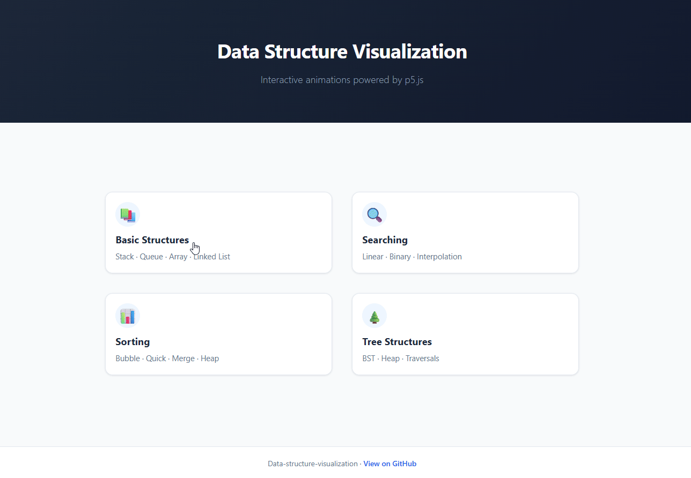

# Data-structure-visualization
An interactive website for visualizing data structures and algorithms, built with HTML, CSS, JavaScript, and p5.js.  

I also include [Data Structure Visualization.pptx](https://github.com/Benjikuo/Data-structure-visualization/blob/main/Data%20Structure%20Visualization.pptx)
<p>
  
</p>

<br>

## 🛠️ Why I Built This
- This is the group project for the **Data Structure course**. We choose this topic because it is the most relevant.
- It is also a good opportunity to learn JS and practice using those data structures in algorithms.
- I think after I finish this project, I will learn a lot. It will benefit me in future web projects.

<br>

## 🧩 Features
- 🔧 **Visualization** – Interactive visuals that help simplify and clarify data structures and algorithms.
- 📑 **Structure** – Modular architecture with four focused sections: Basic Structures, Searching, Sorting, and Trees.
- 🕑 **Interaction** – Real-time operations such as push/pop and enqueue/dequeue for hands-on learning.
- 👟 **Animation** – Step-by-step algorithm animations that reveal how each process works internally.
- ⬜ **Interface** – A clean, minimal UI designed to support intuitive, visualization-based learning.
 

<br>

## 📂 Project Structure  
```
Data structure/
├── assets/
│     ├── css/
│     │    ├── style.css
│     │    └── visualizer.css
│     ├── image/
│     │    └── showcase.gif                  # Demonstration gif
│     └── js/
│          ├── core/
│          │     ├── AnimationStep.js
│          │     └── Visualizer.js
│          └── modules/
│                ├── basic/
│                │     ├── Queue.js
│                │     └── Stack.js
│                ├── searching/
│                │     ├── BinarySearch.js
│                │     └── LinearSearch.js
│                ├── sorting/
│                │     ├── BubbleSort.js
│                │     ├── MergeSort.js
│                │     └── QuickSort.js
│                ├── tree/
│                │     └── BST.js
│                └── utils/
│                      ├── helpers.js
│                      └── p5.min.js          # p5.js library
├── pages/
│     ├── basic.html
│     ├── searching.html
│     ├── sorting.html
│     └── tree.html
├── index.html                                # Main webpage
├── LICENSE                                   # MIT license
└── README.md                                 # Project documentation
```

<br>

## ▶️ How to Run
#### Online Version 
 
- link: [https://benjikuo.github.io/Data-structure-visualization/](https://benjikuo.github.io/Data-structure-visualization/)

#### Run Locally
1. Download or clone the repository.  
2. Double-click `index.html` to open it in your default browser.

<br>

## 📋 Page Overview
**Index** (main navigation hub)  
├── **Basic Structures** (Stack · Queue)    
├── **Searching** (Linear · Binary)   
├── **Sorting** (Bubble · Quick · Merge)  
└── **Tree Structures** (BST)  

<br>

## 📜 License
This project is released under the MIT License.  
You are free to use, modify, and share it for learning or personal projects.  

**It was hard, but completing it made the concepts much clearer for me.**
